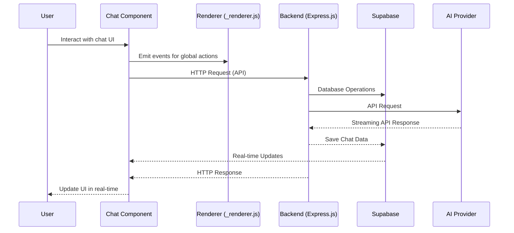

# Sci-Fi Chatbot Application - Technical Design Document

## 1. Overview

This document outlines the technical design for a sci-fi styled chatbot application that combines the visual style and render pipeline of eDEX-UI with the modern feature set and stack of OpenChatUI. The application follows a modular class-based render pipeline orchestrated by `_renderer.js` and injected through `ui.html`, replacing the terminal module with a chat module that follows the same lifecycle.

### Design Objectives:
- Maintain eDEX-UI's modular class-based render pipeline
- Implement a `chat.class.js` module following the same lifecycle as `terminal.class.js`
- Replicate eDEX-UI's grid-based, Tron-inspired design language
- Integrate modern chatbot features from OpenChatUI
- Support Markdown rendering, code blocks, and streaming AI responses
- Enable file upload functionality with inline display
- Replace SQLite/localStorage with Supabase for secure, scalable data storage

### Reference Implementations:
- **eDEX-UI Source** (`edex-source/`): Visual design language, class-based architecture, lifecycle hooks
- **OpenChatUI Example** (`OpenChatUI-example/`): Feature set, API integration, UX patterns
- **Supabase Documentation**: Backend database and authentication solution

## 2. Rendering Pipeline Architecture

The application maintains the modular class-based render pipeline from eDEX-UI, orchestrated by `_renderer.js` and injected through `ui.html`. The terminal module has been replaced with a chat module that follows the same lifecycle.

### eDEX-UI Pipeline Components:

1. **Main Process** (`src/_boot.js`):
   - Creates the fullscreen BrowserWindow
   - Loads `ui.html` as the single-page shell
   - Manages application lifecycle

2. **Shell HTML** (`ui.html`):
   - Loads dependency CSS, assets CSS, module CSS
   - Loads component scripts and `_renderer.js` in correct order

3. **Theme + CSS Layer** (`assets/css/`):
   - CSS grid, variables, theme JSON schema
   - Boot/animation styles
   - Custom sci-fi styling

4. **Component Loading Pattern** (`classes/*.js`):
   - Plain `<script>` files exporting global constructors
   - Instantiated by `_renderer.js` at runtime

5. **Orchestrator Responsibilities** (`_renderer.js`):
   - Loading settings
   - Mirroring assets
   - Listening for IPC overrides
   - Instantiating UI modules in order
   - Exposing lifecycle hooks

6. **Runtime Glue**:
   - Resize behavior
   - Keyboard shortcuts
   - Focus/blur handling
   - Touch-zoom prevention

7. **Production Bundling** (`prebuild-minify.js`):
   - Minifies JS/CSS
   - Copies assets maintaining flat `assets/` + `classes/` layout

## 3. UI/UX Design Implementation

### Sci-Fi Design Language
The application replicates eDEX-UI's grid-based, Tron-inspired design language with:
- Neon borders and glowing panels
- Cyberpunk color schemes
- Animated scanlines and visual effects
- Modular panel layout
- Terminal-style typography

### Chat Interface Components

1. **Chat Messages**:
   - Support for Markdown rendering
   - Syntax highlighted code blocks with copy/download functionality
   - Streaming AI responses with real-time display
   - Message differentiation (user vs assistant vs system)
   - Timestamps and metadata

2. **Input Bar**:
   - Multi-line text input
   - File attachment functionality
   - Inline file preview before sending
   - Send button with keyboard shortcuts
   - Slash command suggestions

3. **Conversation Sidebar**:
   - Session list with search/filter
   - Session creation and management
   - Profile switching
   - Settings access

4. **System Panels**:
   - API status monitoring
   - Token usage tracking
   - Performance metrics
   - Connection indicators

### UI Component Specifications

#### Chat Message Display
- **User Messages**: Right-aligned with distinct color scheme
- **Assistant Messages**: Left-aligned with AI styling
- **System Messages**: Centered with muted colors
- **Streaming Display**: Progressive rendering with typing indicators
- **Markdown Support**: Headers, lists, code blocks, emphasis
- **Code Blocks**: Syntax highlighting with copy/download buttons

#### Input Area
- **Text Input**: Multi-line with auto-resize
- **File Upload**: Drag-and-drop with preview
- **Send Controls**: Button with keyboard shortcut (Enter)
- **New Line**: Keyboard shortcut (Shift+Enter)
- **Slash Commands**: Auto-suggestion dropdown

#### Navigation Elements
- **Session Switching**: Clickable list items
- **Profile Selection**: Dropdown with preview
- **Settings Access**: Dedicated button in sidebar
- **Theme Toggle**: Quick access control
- **Search Function**: Filter sessions in real-time

## 4. Feature Set Implementation

Based on the OpenChatUI example, the following features have been identified for implementation:

### Core Features (MVP Priority)
1. **Persistent Conversations**:
   - Supabase database-backed chat history
   - Session resumption across application restarts
   - Export/import functionality

2. **Multi-Bot Profiles**:
   - Configurable system prompts per profile
   - Provider/model selection per profile
   - Default profile setting

3. **File Upload**:
   - TXT file upload directly in input bar
   - Inline display before sending
   - File type validation

4. **Error Handling**:
   - Retry functionality for failed messages
   - User-friendly error messages
   - Toast notifications

5. **User Management**:
   - Supabase authentication
   - User profiles and preferences
   - Role-based access control

### Extended Features
1. **Theme Customization**:
   - Multiple sci-fi themes
   - Layout configuration options
   - Custom CSS support

2. **Advanced UI Components**:
   - Code block copy/download buttons
   - Syntax highlighting
   - Markdown rendering
   - Streaming response visualization

3. **Collaboration Features**:
   - Shared chat sessions
   - Real-time messaging
   - User presence indicators

4. **Advanced Data Management**:
   - Chat tagging and organization
   - Search across all conversations
   - Data analytics and insights
   - Backup and restore functionality

### Technical Integration Approach

#### State Management
- Replace React/Zustand patterns with vanilla JavaScript state management
- Implement event-driven architecture using custom event emitters
- Use Supabase for persistent settings and user data
- Leverage existing eDEX-UI lifecycle hooks

#### Streaming API Handling
- Adapt Express.js backend to support Server-Sent Events (SSE)
- Modify frontend to handle chunked responses
- Implement progressive UI updates during streaming

#### Markdown/Code Rendering
- Integrate lightweight Markdown parser (e.g., marked.js)
- Add syntax highlighting library (e.g., Prism.js)
- Create custom renderers for sci-fi styling

#### File Handling
- Implement drag-and-drop support
- Add file type validation
- Create preview components
- Handle file upload to Supabase storage

#### Supabase Integration
- Replace SQLite/localStorage with Supabase PostgreSQL database
- Implement Supabase authentication for user management
- Use Supabase Realtime for live updates
- Leverage Supabase Storage for file uploads
- Utilize Supabase Functions for serverless backend logic

## 5. Technology Stack Mapping

### OpenChatUI to eDEX-UI Technology Mapping

| OpenChatUI Component | Function | eDEX-UI Equivalent | Implementation Approach |
|---------------------|----------|-------------------|----------------------|
| **Next.js** | Frontend framework | Vanilla JavaScript + eDEX renderer pipeline | Maintain existing eDEX architecture |
| **Tailwind CSS** | Styling framework | Custom CSS with sci-fi themes | Extend existing CSS with chat components |
| **Zustand** | State management | Custom event emitters + Supabase | Implement event-driven state management |
| **React Markdown** | Markdown rendering | Marked.js + custom renderers | Integrate lightweight Markdown parser |
| **Prism.js** | Syntax highlighting | Prism.js (same library) | Direct integration |
| **Axios** | HTTP client | Fetch API or Axios | Continue using Axios |
| **React Hooks** | Component logic | Class methods + lifecycle hooks | Use class-based approach |
| **Supabase** | Backend database | SQLite | Replace with Supabase PostgreSQL |
| **Supabase Auth** | Authentication | Custom auth | Use Supabase authentication |
| **Supabase Realtime** | Live updates | Polling | Implement real-time updates |

### Stack Adaptation Strategy

#### Frontend Framework Approach
- Maintain eDEX-UI's class-based component system
- Use `_renderer.js` as the application orchestrator
- Implement component communication through custom events
- Leverage existing theme system for styling consistency

#### State Management Solution
- Replace React/Zustand patterns with vanilla JavaScript
- Implement event-driven architecture using custom event emitters
- Use Supabase for persistent settings and chat history
- Leverage existing eDEX-UI lifecycle hooks for state synchronization

#### Styling Implementation
- Extend existing eDEX-UI CSS with chat-specific components
- Maintain sci-fi design language consistency across all UI elements
- Create component-specific CSS modules for chat functionality
- Implement theme switching using existing eDEX-UI theme system

#### API Integration Method
- Utilize existing Express.js backend structure
- Add new RESTful endpoints for chat functionality
- Implement streaming response handling with Server-Sent Events
- Maintain consistent error handling and validation patterns

#### Backend Database Integration
- Replace SQLite with Supabase PostgreSQL
- Implement Supabase client for database operations
- Use Supabase authentication instead of custom user system
- Leverage Supabase Realtime for live data updates

#### Package Dependencies
- Add `@supabase/supabase-js` for Supabase client integration
- Remove `sqlite3` and `sequelize` dependencies
- Update backend models to use Supabase client instead of Sequelize

#### Database Schema Mapping

**Current SQLite Schema (Sequelize Models)**:
- `Chat` model with fields: id, title, userId, folderId, shareId, archived, pinned, meta
- `Message` model with fields: id, chatId, role, content, model, provider, tokens, meta
- `User` model (implicit)
- `Tag`, `Folder`, `Profile`, `Preference`, `Tool` models

**New Supabase Schema**:
- `chats` table with equivalent fields plus Supabase-specific fields (created_at, updated_at)
- `messages` table with equivalent fields plus Supabase-specific fields
- `users` table for Supabase Auth integration
- `tags`, `folders`, `profiles`, `preferences`, `tools` tables
- Row Level Security (RLS) policies for data isolation
- Realtime subscriptions for live updates

## 6. Development Milestones

### Milestone 1: Core Chat Functionality (Week 1-2)
- Implement `chat.class.js` with complete lifecycle methods
- Create sci-fi themed `chat.css` styling
- Develop basic message display and input handling
- Integrate with `_renderer.js` pipeline
- Add Supabase integration for conversations persistence

### Milestone 2: Advanced Features (Week 3-4)
- Integrate Markdown rendering with marked.js
- Add Prism.js syntax highlighting for code blocks
- Implement streaming response handling with SSE
- Create file upload with drag-and-drop support
- Add comprehensive error handling with retry UI

### Milestone 3: Session Management (Week 5-6)
- Implement multi-session navigation system
- Add search and filtering capabilities
- Create profile management with system prompts
- Enable export/import functionality (JSON format)
- Add theme customization options
- Implement Supabase authentication and user management

### Milestone 4: Enhanced UX (Week 7-8)
- Implement copy/download for code blocks
- Add slash command suggestions
- Create advanced system monitoring panels
- Enhance keyboard navigation and shortcuts
- Add accessibility improvements and screen reader support
- Implement real-time collaboration features with Supabase

## 7. Module Specifications

### Chat Class Module
- **File**: `src/classes/chat.class.js`
- **Base Class**: Extend eDEX-UI component base class
- **Lifecycle Methods**:
  - `init()`: Initialize chat component
  - `resize()`: Handle window resize events
  - `destroy()`: Clean up resources
- **Core Methods**:
  - `sendMessage()`: Handle message submission
  - `displayMessage()`: Render messages
  - `handleFileUpload()`: Process file attachments
  - `streamResponse()`: Handle streaming responses

### Chat CSS Module
- **File**: `src/assets/css/chat.css`
- **Design Principles**:
  - Follow eDEX-UI grid-based layout
  - Implement Tron-inspired color schemes
  - Add neon border effects
  - Include animation effects
- **Component Styles**:
  - Message bubbles
  - Input area
  - File preview
  - Streaming indicators

### Renderer Integration
- **File**: `src/_renderer.js`
- **Integration Points**:
  - Instantiate chat module during boot sequence
  - Register for global events
  - Coordinate with system panels
  - Handle theme changes

### Supabase Integration Module
- **File**: `src/backend/supabase.js`
- **Purpose**: Centralize Supabase client configuration and operations
- **Core Functions**:
  - `initSupabase()`: Initialize Supabase client
  - `authenticateUser()`: Handle user authentication
  - `fetchChats()`: Retrieve user chats
  - `saveChat()`: Save chat to database
  - `uploadFile()`: Handle file uploads to Supabase Storage

### API Endpoint Specifications

| Endpoint | Method | Purpose |
|----------|--------|---------|
| `/api/chat/send` | POST | Send messages to AI providers |
| `/api/chat/:id` | GET | Retrieve specific chat history |
| `/api/chat` | GET | Get all chats |
| `/api/chat/new` | POST | Create new chat session |
| `/api/providers/test` | POST | Test API provider connections |
| `/api/profiles` | GET/POST | Manage chat profiles |
| `/api/tools` | GET/POST/PUT/DELETE | Manage custom tools |
| `/api/auth/login` | POST | User authentication |
| `/api/auth/logout` | POST | User logout |
| `/api/users/profile` | GET/PUT | User profile management |

## 8. Technical Architecture

### Component Architecture
The chat module follows eDEX-UI's established component architecture pattern:

```
Chat Class (chat.class.js)
├── Lifecycle Methods
│   ├── init() - Component initialization
│   ├── resize() - Handle window resize
│   └── destroy() - Cleanup resources
├── Core Functionality
│   ├── Message Handling
│   ├── File Upload Processing
│   ├── Streaming Response Management
│   └── UI State Management
└── Event Integration
    ├── Custom Event Emitters
    ├── Renderer Communication
    └── Theme System Hooks
```

### Data Flow Architecture



### Integration Points
1. **Renderer Pipeline**: `_renderer.js` instantiates and manages the chat component
2. **Theme System**: Chat component integrates with existing eDEX-UI theme engine
3. **Event System**: Custom events for communication between components
4. **Backend API**: RESTful endpoints for chat functionality
5. **Storage Layer**: Supabase for persistence and real-time features
6. **Authentication**: Supabase Auth for user management

## 9. Development Process

### Code Structure Guidelines
- Follow eDEX-UI modular class pattern
- Maintain consistent lifecycle hooks
- Use existing theme system for styling
- Implement error handling consistently

### Component Development Process
- Extend base component classes
- Implement init/resize/destroy methods
- Use event emitters for communication
- Follow existing CSS naming conventions

### Testing Approach
- Test components in isolation
- Verify integration with renderer
- Check cross-platform compatibility
- Validate theme consistency

### Review Process
- Code review against eDEX-UI patterns
- Functional testing of all features
- Performance evaluation
- Cross-platform verification

### Supabase Migration Process
1. **Setup Phase**: Configure Supabase project and database schema
2. **Migration Phase**: Migrate existing SQLite data to Supabase
3. **Integration Phase**: Replace Sequelize/SQLite calls with Supabase client
4. **Testing Phase**: Validate all database operations work correctly
5. **Deployment Phase**: Deploy updated backend with Supabase integration

## 10. Success Criteria

### Functional Requirements
- Chat module loads and displays correctly
- Messages render with Markdown support
- Code blocks show syntax highlighting
- File uploads work with preview
- Streaming responses display progressively
- Error handling works with retry options
- User authentication with Supabase
- Real-time chat updates with Supabase Realtime
- Data persistence with Supabase database

### Technical Requirements
- Component follows eDEX-UI lifecycle
- State management works correctly
- Theme system integrates properly
- API communication functions
- Performance meets expectations
- Supabase integration functions correctly
- Real-time updates work properly

### User Experience Goals
- Interface matches eDEX-UI design language
- Navigation is intuitive
- Responses are timely
- Errors are handled gracefully
- Customization options work

## 11. OpenChatUI Feature Replication

To ensure full feature parity with OpenChatUI, the following functionality must be implemented:

### Core Chat Features
- **Multi-model conversations**: Support for switching between different AI providers and models
- **Chat history management**: Persistent storage and retrieval of conversation history
- **Message tagging**: Ability to tag and categorize conversations
- **Folder organization**: Group chats into folders for better organization
- **Search functionality**: Search across all conversations and messages
- **Export/Import**: JSON export and import of chat data

### Advanced Features
- **File uploads**: Support for document uploads and processing
- **Code execution**: Integration with code execution environments
- **Image generation**: Support for image generation models
- **Voice input**: Speech-to-text capabilities
- **Web search**: Integration with search providers for RAG
- **Plugin system**: Extensible architecture for custom functionality

### User Management
- **User profiles**: Personalized settings and preferences
- **Role-based access**: Different permission levels for users
- **Team collaboration**: Shared workspaces and conversations
- **Audit logging**: Track user activities and changes

### Integration Capabilities
- **Ollama support**: Direct integration with local Ollama instances
- **OpenAI API compatibility**: Support for OpenAI-compatible endpoints
- **Custom model providers**: Extensible provider system
- **API tools**: Integration with external APIs and services

### Feature Implementation Priority

**Phase 1 - MVP (Weeks 1-3)**:
- Core chat functionality with Supabase backend
- Multi-model support with existing providers
- Basic chat history management
- User authentication with Supabase Auth

**Phase 2 - Enhanced Features (Weeks 4-6)**:
- File upload and storage
- Message tagging and folder organization
- Search functionality
- Export/Import capabilities

**Phase 3 - Advanced Features (Weeks 7-10)**:
- Real-time collaboration
- Code execution environment
- Image generation integration
- Plugin system implementation

**Phase 4 - Enterprise Features (Weeks 11-12)**:
- Team collaboration
- Audit logging
- Advanced analytics
- Custom model provider integration

## 12. Supabase Backend Architecture

The backend will be migrated from SQLite to Supabase to provide a more robust, scalable, and secure solution.

### Database Schema
The Supabase database will implement the following tables based on OpenChatUI models:

1. **Users**: User profiles and authentication
2. **Chats**: Chat sessions with metadata
3. **Messages**: Individual messages with role and content
4. **Profiles**: AI model profiles with system prompts
5. **Folders**: Chat organization structure
6. **Tags**: Tagging system for categorization
7. **Tools**: Custom tools and functions
8. **Preferences**: User preferences and settings
9. **Files**: File metadata and storage references

### Authentication
- **Supabase Auth**: Email/password, OAuth providers
- **Session management**: JWT-based authentication
- **Role-based access**: User, admin, and custom roles
- **Password recovery**: Secure password reset flow

### Real-time Features
- **Real-time updates**: Live chat updates using Supabase Realtime
- **Presence indicators**: Show online/offline status
- **Collaborative editing**: Shared document editing
- **Notifications**: Real-time notification system

### Storage
- **File storage**: Supabase Storage for document uploads
- **Media handling**: Support for images and other media
- **Access control**: Private/public file access
- **CDN integration**: Fast content delivery

### Security
- **Row Level Security (RLS)**: Database-level access control
- **API security**: Rate limiting and request validation
- **Data encryption**: Encryption at rest and in transit
- **Audit trails**: Comprehensive logging of all actions

## 13. Implementation Steps

### Phase 1: Supabase Setup (Week 1)
1. Create Supabase project
2. Define database schema based on current models
3. Set up authentication and RLS policies
4. Configure storage buckets for file uploads
5. Set up environment variables for Supabase connection

### Phase 2: Backend Migration (Week 2-3)
1. Install `@supabase/supabase-js` dependency
2. Create Supabase client configuration
3. Replace Sequelize models with Supabase client calls
4. Update routes to use Supabase instead of SQLite
5. Implement authentication endpoints
6. Test all backend functionality

### Phase 3: Frontend Integration (Week 4-5)
1. Update frontend to use Supabase client for data operations
2. Implement authentication flow
3. Add real-time subscriptions for chat updates
4. Replace localStorage usage with Supabase storage
5. Test data synchronization

### Phase 4: Feature Enhancement (Week 6-8)
1. Implement real-time collaboration features
2. Add file storage integration
3. Implement advanced search functionality
4. Add backup/restore capabilities
5. Implement analytics dashboard
6. Performance optimization and testing

## 14. Conclusion

This technical design document outlines a comprehensive plan for developing a sci-fi styled chatbot application that combines the visual aesthetics of eDEX-UI with the modern functionality of OpenChatUI. By integrating Supabase as the backend solution, we address the limitations of localStorage and SQLite while providing enterprise-grade features such as real-time collaboration, robust authentication, and scalable data storage.

The implementation approach maintains the core eDEX-UI architecture while extending it with modern web technologies. The phased development plan ensures that core functionality is delivered first, followed by enhanced features and enterprise capabilities.

Key benefits of this approach include:
- **Enhanced Security**: Supabase provides enterprise-grade security features
- **Scalability**: PostgreSQL backend can handle growing data requirements
- **Real-time Collaboration**: Built-in real-time features enable collaborative workflows
- **Cross-Platform Compatibility**: Electron framework ensures consistent experience across platforms
- **Extensibility**: Modular architecture allows for easy feature additions

By following this design, we will create a powerful, visually stunning chatbot application that combines the best of both reference implementations while providing a modern, secure, and scalable solution for users.