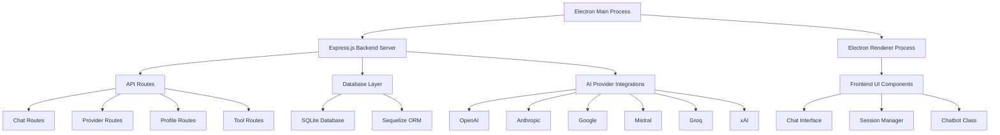
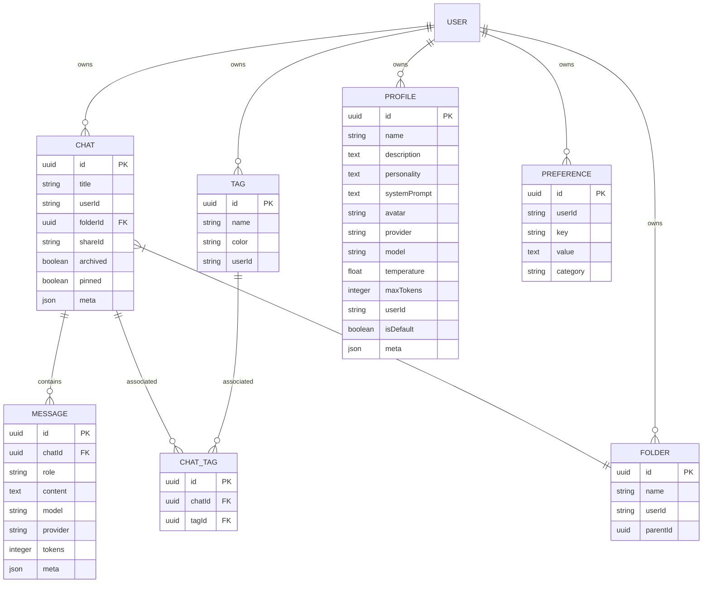

# Electron DEX - Full Codebase Documentation

## 1. Overview

Electron DEX is a sophisticated Electron-based application that combines the cyberpunk aesthetics of eDEX-UI with a powerful chatbot interface supporting multiple AI providers. The application features a modern frontend built with HTML/CSS/JavaScript and a backend Express.js server with SQLite database storage, all packaged in a single Electron application.

### Key Features
- Cyberpunk-themed UI inspired by eDEX-UI
- Multi-provider AI integration (OpenAI, Anthropic, Google, Mistral, Groq, xAI)
- Session management with search and filtering
- Real-time chat with streaming responses
- Database persistence using SQLite and Sequelize ORM
- Tool/function calling capabilities
- Responsive design for various screen sizes
- Rate limiting and security best practices

## 2. Architecture

The application follows a client-server architecture where:
- The **Frontend** is an Electron-rendered web application with cyberpunk styling
- The **Backend** is an Express.js server integrated within the Electron main process
- The **Database** is SQLite with Sequelize ORM for data persistence
- **AI Providers** are implemented as modular components for easy extension



## 3. Technology Stack

### Frontend
- **Electron**: Cross-platform desktop application framework
- **HTML5/CSS3**: Modern web technologies for UI
- **JavaScript (ES6+)**: Application logic
- **WebGL**: Hardware-accelerated graphics
- **FontFace API**: Custom font loading
- **Fetch API**: HTTP requests

### Backend
- **Node.js**: JavaScript runtime environment
- **Express.js**: Web application framework
- **SQLite**: Lightweight database engine
- **Sequelize**: Promise-based ORM for Node.js
- **Axios**: HTTP client for API requests

### Security & Utilities
- **Helmet**: Security middleware
- **CORS**: Cross-Origin Resource Sharing protection
- **Rate Limiter Flexible**: Request rate limiting
- **UUID**: Unique identifier generation

## 4. Frontend Architecture

### Component Structure
The frontend follows a modular component architecture with the following key components:

1. **Main Application Container** (`src/ui.html`)
   - Status header with model selector and connection status
   - Sidebar with session management
   - Main chat feed area
   - Input bar with message composition
   - System panels for statistics

2. **Core Classes** (`src/classes/`)
   - `Chat`: Manages chat interactions and communication with backend
   - `SessionManager`: Handles session creation, storage, and retrieval

3. **Utility Modules** (`src/utils/`)
   - `MarkdownRenderer`: Renders markdown content in chat messages

### UI Components

#### Chat Interface
The chat interface consists of:
- Message bubbles for user, AI, and system messages
- Real-time typing indicators
- Markdown rendering for rich content
- Responsive design for various screen sizes

#### Session Management
- Session creation with auto-generated titles
- Session persistence using localStorage
- Session search and filtering
- Pinning important sessions

#### Input Handling
- Multi-line text input with auto-resizing
- Slash command suggestions
- Keyboard shortcuts (Enter to send, Shift+Enter for new line)
- File upload capabilities (placeholder)

### Styling System
The application uses a modular CSS approach:
- `main.css`: Core styling and resets
- `chat.css`: Chat-specific components
- `chatbot_layout.css`: Layout structure
- `boot_screen.css`: Boot sequence styling
- `modal.css`: Modal dialogs and overlays
- Theme files in `src/assets/themes/` for customization

## 5. Backend Architecture

### API Endpoints Reference

#### Chat Endpoints
- `POST /api/chat/new`: Create a new chat session
- `GET /api/chat/:id`: Retrieve a specific chat by ID
- `GET /api/chat`: Get all chats for a user
- `PUT /api/chat/:id`: Update chat properties
- `DELETE /api/chat/:id`: Delete a chat
- `POST /api/chat/send`: Send a message to an AI provider
- `POST /api/chat/completions`: OpenAI-compatible chat completions endpoint

#### Provider Endpoints
- `GET /api/providers`: List all available providers
- `POST /api/providers/test`: Test connection to a provider
- `GET /api/config/models`: Get available models

#### Profile Endpoints
- `GET /api/profiles`: Get all profiles
- `POST /api/profiles`: Create a new profile
- `GET /api/profiles/:id`: Get a specific profile
- `PUT /api/profiles/:id`: Update a profile
- `DELETE /api/profiles/:id`: Delete a profile
- `POST /api/profiles/:id/default`: Set a profile as default

#### Tool Endpoints
- `GET /api/tools`: Get all tools
- `POST /api/tools`: Create a new tool
- `GET /api/tools/:id`: Get a specific tool
- `PUT /api/tools/:id`: Update a tool
- `DELETE /api/tools/:id`: Delete a tool
- `POST /api/tools/execute/:id`: Execute a tool

#### Tag Endpoints
- `GET /api/tags`: Get all tags
- `POST /api/tags`: Create a new tag
- `DELETE /api/tags/:id`: Delete a tag
- `POST /api/tags/:chatId/tag/:tagId`: Add tag to chat
- `DELETE /api/tags/:chatId/tag/:tagId`: Remove tag from chat

#### Folder Endpoints
- `GET /api/folders`: Get all folders
- `POST /api/folders`: Create a new folder
- `PUT /api/folders/:id`: Update a folder
- `DELETE /api/folders/:id`: Delete a folder
- `POST /api/folders/:folderId/chat/:chatId`: Move chat to folder

#### Preference Endpoints
- `GET /api/preferences/:userId`: Get all preferences for user
- `GET /api/preferences/:userId/:key`: Get preference by key
- `POST /api/preferences`: Create or update preference
- `PUT /api/preferences/:userId/:key`: Update preference
- `DELETE /api/preferences/:userId/:key`: Delete preference

### Data Models & ORM Mapping

#### Chat Model
```javascript
{
  id: UUID (Primary Key)
  title: STRING
  userId: STRING
  folderId: STRING (Foreign Key)
  shareId: STRING (Unique)
  archived: BOOLEAN
  pinned: BOOLEAN
  meta: JSON
}
```

#### Message Model
```javascript
{
  id: UUID (Primary Key)
  chatId: UUID (Foreign Key)
  role: STRING (system|user|assistant)
  content: TEXT
  model: STRING
  provider: STRING
  tokens: INTEGER
  meta: JSON
}
```

#### Profile Model
```javascript
{
  id: UUID (Primary Key)
  name: STRING
  description: TEXT
  personality: TEXT
  systemPrompt: TEXT
  avatar: STRING
  provider: STRING
  model: STRING
  temperature: FLOAT
  maxTokens: INTEGER
  userId: STRING
  isDefault: BOOLEAN
  meta: JSON
}
```

#### Tool Model
```javascript
{
  id: UUID (Primary Key)
  name: STRING
  description: TEXT
  content: TEXT
  userId: STRING
  meta: JSON
}
```

#### Tag Model
```javascript
{
  id: UUID (Primary Key)
  name: STRING
  color: STRING
  userId: STRING
}
```

#### Folder Model
```javascript
{
  id: UUID (Primary Key)
  name: STRING
  userId: STRING
  parentId: UUID
}
```

#### Preference Model
```javascript
{
  id: UUID (Primary Key)
  userId: STRING
  key: STRING
  value: TEXT
  category: STRING
}
```

### Business Logic Layer

#### Chat Management
The chat management system handles:
- Creating and storing chat sessions
- Managing message history
- Handling real-time communication with AI providers
- Supporting both streaming and non-streaming responses
- Implementing retry mechanisms for failed requests

#### Provider Integration
Each AI provider is implemented as a separate module with:
- Standardized API for sending messages
- Streaming support for real-time responses
- Error handling and retry mechanisms
- Model-specific configurations
- Connection testing capabilities

#### Tool System
The tool system enables function calling:
- Tool definition and storage in database
- Parameter extraction from tool definitions
- Tool execution with sandboxing (simulated)
- Integration with AI responses for tool calling
- Result processing and formatting

#### Session Management
The session management system provides:
- Local storage persistence
- Session creation with auto-generated titles
- Session search and filtering
- Pinning important sessions
- Profile-based customization

## 6. Database Layer

The application uses SQLite with Sequelize ORM for data persistence:

### Database Schema Design



### Database Initialization
The database is initialized on application startup with:
- Automatic schema creation and migration
- Default profile creation
- Sample tool creation
- Connection testing and error handling

## 7. Security Implementation

### Security Measures
1. **Content Security Policy (CSP)**: Configured to prevent XSS attacks
2. **Rate Limiting**: Implemented using rate-limiter-flexible to prevent abuse
3. **Input Sanitization**: All user inputs are sanitized before processing
4. **API Key Management**: Secure storage and handling of provider API keys
5. **CORS Protection**: Properly configured CORS settings
6. **Helmet.js**: Security middleware for Express.js

### Authentication & Authorization
The application uses a simple user-based system where:
- All data is associated with a userId
- Default userId is 'default' for single-user scenarios
- Future extensions could implement proper authentication

## 8. Error Handling & Logging

### Error Handling Strategy
- Centralized error handling in Express middleware
- User-friendly error messages for frontend display
- Detailed error logging for debugging
- Retry mechanisms for transient failures
- Graceful degradation for non-critical failures

### Logging
- Console logging for development and debugging
- Structured logging with timestamps and context
- Error logging with stack traces
- Request/response logging for API endpoints

## 9. Performance Optimization

### Performance Considerations
1. **Database Optimization**:
   - Indexes on frequently queried fields
   - Efficient query patterns
   - Connection pooling

2. **Frontend Optimization**:
   - Lazy loading of chat history
   - Efficient DOM updates
   - Caching of frequently accessed data

3. **Network Optimization**:
   - Streaming responses for real-time updates
   - Compression of API responses
   - Efficient data serialization

## 10. Testing Strategy

### Unit Testing
- Model validation tests
- Route handler tests
- Provider integration tests
- Utility function tests

### Integration Testing
- End-to-end API testing
- Database integration tests
- Provider connectivity tests

### UI Testing
- Component rendering tests
- User interaction tests
- Responsive design validation

## 11. Deployment & Distribution

### Building for Distribution
The application can be built for distribution using electron-builder:
1. Install electron-builder: `npm install --save-dev electron-builder`
2. Run build command: `npm run build`

### Supported Platforms
- Windows (exe, msi)
- macOS (dmg, zip)
- Linux (AppImage, deb, rpm)

### Environment Configuration
- Environment variables for API keys and configuration
- Separate configuration for development and production
- Dotenv for environment variable management

## 12. Customization & Extension

### Theme Customization
- Multiple cyberpunk themes available
- JSON-based theme configuration
- Easy addition of new themes

### Adding New AI Providers
1. Create a new provider file in `src/backend/providers/`
2. Implement the required methods (sendMessage, testConnection, etc.)
3. Add route configuration in the backend
4. Update the frontend provider selector

### Tool Extension
1. Define new tools in the database
2. Implement tool execution logic
3. Update the tools provider
4. Test integration with AI providers

### UI Customization
- Modify CSS files in `src/assets/css/`
- Update HTML structure in `src/ui.html`
- Extend JavaScript functionality in `src/main.js`

## 13. Future Enhancements

### Planned Features
1. **Enhanced Security**:
   - User authentication system
   - Encrypted storage for sensitive data
   - Advanced access controls

2. **Advanced Features**:
   - Voice input/output
   - Image generation capabilities
   - Plugin system for third-party integrations
   - Advanced analytics and reporting

3. **Performance Improvements**:
   - Database query optimization
   - Caching mechanisms
   - Memory usage optimization

4. **UI/UX Enhancements**:
   - Advanced theming system
   - Customizable layouts
   - Improved accessibility
   - Mobile-specific optimizations
