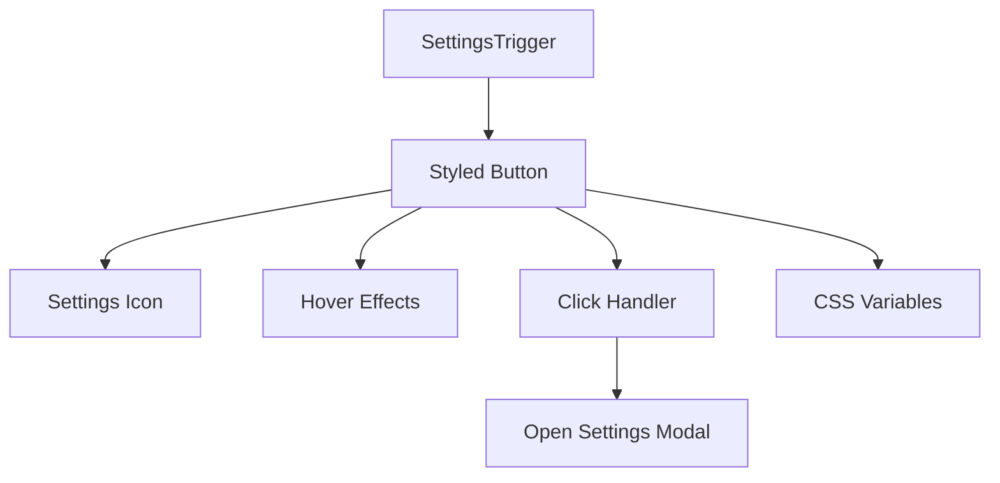
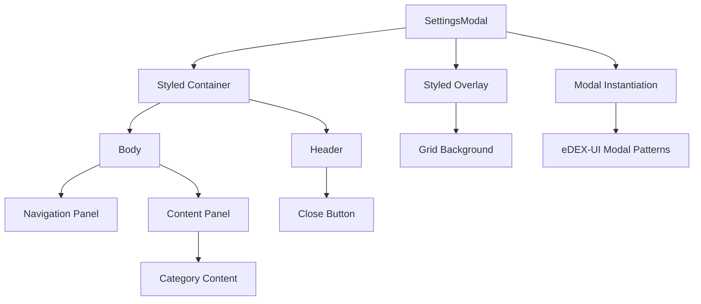

# Popup Settings Modal Design Document

## Overview

This document outlines the design for a popup Settings Modal component for the Electron-DEX chatbot application. The modal will follow the authentic eDEX-UI aesthetic with a dark sci-fi console appearance, glowing neon edges, sharp block design, and grid overlay. The implementation will use React with styled-components to create a native-like eDEX-UI panel experience.

The design will replace the existing LM Studio-style settings modal with a fully eDEX-UI compliant implementation that matches the authentic cyberpunk aesthetic of the original eDEX-UI application. The settings button will be integrated into the existing sidebar and will follow eDEX-UI modal patterns for opening and rendering the settings interface using authentic eDEX-UI icons.

## Architecture

### Component Structure

The Settings Modal will consist of the following components:

1. **SettingsTrigger** - A button component that opens the modal when clicked
2. **SettingsModal** - The main modal component with:
   - Overlay with grid background
   - Header with title and close button
   - Two-column layout:
     - Left navigation panel with category list
     - Right content panel with settings options
3. **Category Components** - Individual components for each settings category:
   - GeneralSettings
   - ChatExperienceSettings
   - AppearanceSettings
   - AIBehaviorSettings
   - AdvancedSettings

The implementation will replace the existing `SettingsModal.tsx` and `SettingsTrigger.tsx` components with new versions that fully comply with the authentic eDEX-UI aesthetic. All new components will be implemented using styled-components for consistent styling and will use Font Awesome icons from the local `media/icons` directory to maintain authenticity with the original eDEX-UI application.

### Technology Stack

- **React** - Component-based UI library
- **styled-components** - CSS-in-JS library for styling
- **framer-motion** - Animation library (already in project dependencies)
- **Font Awesome** - Icon library (from local media/icons directory)

The implementation will leverage CSS variables from the existing eDEX-UI theme system to ensure visual consistency with the rest of the application. The modal will follow eDEX-UI instantiation patterns while using modern React patterns for state management. Icons will be implemented using the same Font Awesome icon set used in the original eDEX-UI application, loaded from the local `media/icons` directory.

## UI Design

### Visual Style

The modal will follow the authentic eDEX-UI aesthetic with:

- Dark background (`#05080d`)
- Neon accent colors (using CSS variables: `rgb(var(--color_r), var(--color_g), var(--color_b))`)
- Sharp block edges (no rounded corners)
- Glowing borders and elements
- Grid overlay background
- Monospace fonts (`Fira Mono`)
- Cyberpunk-inspired design language

All styling will be implemented using styled-components with CSS variables from the existing eDEX-UI theme system to ensure consistency with the rest of the application. The visual style will match the augmented-ui patterns used in eDEX-UI modals with clipping and glowing effects. The design will use authentic eDEX-UI icons from the Font Awesome icon set loaded from the local `media/icons` directory rather than emoji or third-party icon libraries.

### Layout

```
┌─────────────────────────────────────────────────────────────────────┐
│  SETTINGS MODAL                                                     │
├─────────────────────────────────────────────────────────────────────┤
│  SYSTEM CONFIGURATION                          [✕]                 │
├─────────────────────────────────────────────────────────────────────┤
│  │ NAVIGATION │  CONTENT PANEL                                   │
│  │            │                                                  │
│  │ [ cog ] General    ▢ Language selector                        │
│  │ [ comment ] Chat   ▢ Date/time format                         │
│  │ [ palette ] Appearance ▢ Input mode toggle                    │
│  │ [ robot ] AI       ▢ Typing indicator toggle                  │
│  │ [ terminal ] Advanced ▢ History: clear / auto-delete         │
│  │                ▢ Notifications toggle                         │
│  │                ▢ Autoscroll toggle                            │
│  │                ▢ Token-by-token rendering toggle              │
│  │                ▢ Markdown toggle                              │
│  │                ▢ Theme selector: dark/light/system            │
│  │                ▢ Font size slider                             │
│  │                ▢ Chat bubble style: terminal/modern           │
│  │                ▢ Background: grid / solid / gradient          │
│  │                ▢ Model selector (dropdown)                    │
│  │                ▢ Response style (concise/detailed/balanced)   │
│  │                ▢ Creativity slider (temperature)              │
│  │                ▢ Max response length                          │
│  │                ▢ Developer mode (raw JSON toggle)             │
│  │                ▢ Debug logs toggle                            │
│  │                ▢ Shortcut config                              │
│  │                ▢ Experimental features                        │
└─────────────────────────────────────────────────────────────────────┘
```

The layout will be implemented using CSS Grid and Flexbox within styled-components to achieve the authentic eDEX-UI aesthetic with sharp edges and glowing borders. The modal will follow eDEX-UI patterns for sizing, positioning, and draggable behavior using the same augmented-ui patterns as the original eDEX-UI modals.

### Color Palette

| Element | Color | CSS Variable |
|---------|-------|--------------|
| Primary Accent | Cyan/Teal | `rgb(var(--color_r), var(--color_g), var(--color_b))` |
| Background | Dark Black | `#05080d` |
| Border | Neon Glow | `rgba(var(--color_r), var(--color_g), var(--color_b), 0.3)` |
| Text Primary | Neon Glow | `rgb(var(--color_r), var(--color_g), var(--color_b))` |
| Text Secondary | Dim Gray | `rgba(var(--color_r), var(--color_g), var(--color_b), 0.7)` |

These colors will be implemented using styled-components with CSS variables to ensure consistency with the existing eDEX-UI theme. The color scheme follows the same patterns used in eDEX-UI modal components. All colors will use the authentic eDEX-UI CSS variables to maintain visual consistency.

## Component Specifications

### SettingsTrigger Component



The SettingsTrigger component will be integrated into the existing sidebar structure and will follow eDEX-UI patterns for button styling and interaction. When clicked, it will instantiate the SettingsModal component following the same pattern used in eDEX-UI for modal instantiation. The settings icon will use the Font Awesome `cog` icon loaded from the local `media/icons` directory to maintain authenticity with the original eDEX-UI application.

#### Properties
- Position: Fixed in sidebar
- Icon: Gear icon from lucide-react
- Behavior: Opens SettingsModal on click

#### Styling
- Sharp block edges
- Glowing neon border
- Hover animations with scale and glow effects

### SettingsModal Component



The SettingsModal component will follow eDEX-UI modal patterns for instantiation, focus management, and z-index handling. It will be implemented as a React component using styled-components while maintaining the same modal behavior patterns found in the original eDEX-UI codebase.

#### Properties
- isOpen: boolean - Controls modal visibility
- onClose: function - Handler for closing the modal

#### Behavior
- Opens when SettingsTrigger is clicked, following eDEX-UI modal instantiation patterns
- Closes when:
  - Close button (✕) is clicked
  - ESC key is pressed
  - Click outside the modal content
- Applies settings instantly (no save button)
- Follows eDEX-UI focus and z-index management patterns
- Supports dragging like other eDEX-UI modals

### Navigation Panel

#### Categories
1. General (`cog` icon from Font Awesome loaded from media/icons)
2. Chat Experience (`comment` icon from Font Awesome loaded from media/icons)
3. Appearance (`palette` icon from Font Awesome loaded from media/icons)
4. AI Behavior (`robot` icon from Font Awesome loaded from media/icons)
5. Advanced (`terminal` icon from Font Awesome loaded from media/icons)

#### Styling
- Active category highlighted with neon glow
- Hover effect with subtle glow pulse
- Vertical layout with Font Awesome icons and text
- Icons styled with eDEX-UI neon accent colors
- All icons loaded from local `media/icons` directory

### Content Panels

Each panel will contain:

1. **Header** - Monospace font with neon underline
2. **Settings Groups** - Stacked sections with:
   - Header in monospace, neon underline
   - Grouped settings inside glowing bordered boxes
   - Descriptions in small, dim-gray monospace text

#### Settings Elements

All interactive elements will have glow feedback when changed:

1. **Toggles** - Smooth thumb slide with glow effect
2. **Sliders** - Custom styled with neon thumb
3. **Dropdowns** - Sharp edges with glowing border
4. **Buttons** - Block design with hover glow
5. **Text Inputs** - Glowing border on focus

Each element will be implemented as a styled-component with consistent styling that matches the eDEX-UI aesthetic and provides visual feedback on interaction. The elements will follow the same styling patterns used in eDEX-UI modal components with sharp edges and neon accents. All interactive elements will use the same CSS variables and styling patterns as the original eDEX-UI components.

## Animations

### CSS Transitions
- Modal open/close: Scale-up animation with neon edge glow
- Category switching: Fade/slide transition
- Toggles: Smooth thumb slide with glow
- Hover states: Neon pulse animation using keyframes

### Keyframe Animations
- Glow pulse for active elements
- Scanline effect for grid background
- Slide-in animations for content

All animations will be implemented using CSS transitions and keyframes within styled-components. The animations will use the eDEX-UI color palette and follow the authentic cyberpunk aesthetic with subtle glowing effects. The animations will match the smooth transitions found in eDEX-UI modals using the same timing functions and effects as the original application.

## State Management

### Settings State Structure

```javascript
interface SettingsState {
  // General
  language: string;
  dateFormat: string;
  inputMode: 'text' | 'voice';
  typingIndicator: boolean;
  
  // Chat Experience
  historyDays: number;
  notifications: boolean;
  autoscroll: boolean;
  tokenRendering: boolean;
  markdownRendering: boolean;
  
  // Appearance
  theme: 'dark' | 'light' | 'system';
  fontSize: number;
  chatStyle: 'terminal' | 'modern';
  background: 'grid' | 'solid' | 'gradient' | 'custom';
  
  // AI Behavior
  model: string;
  responseStyle: 'concise' | 'detailed' | 'balanced';
  temperature: number;
  maxTokens: number;
  
  // Advanced
  developerMode: boolean;
  debugLogs: boolean;
  shortcuts: Record<string, string>;
  experimental: boolean;
}
```

### Persistence
- Settings will be stored in localStorage
- Settings applied instantly without requiring a save button
- State management will use React hooks (useState, useEffect) for efficient updates and persistence
- Will follow eDEX-UI patterns for settings persistence and retrieval

## Integration Points

### Existing Components
- Will integrate with existing sidebar through the settings button
- Will use existing CSS variables for consistent theming
- Will leverage Font Awesome icon library from local media/icons directory
- Will maintain compatibility with existing SettingsBridge.js
- Will follow eDEX-UI modal patterns for instantiation and rendering

### Event Handling
- ESC key press to close modal
- Outside click to close modal
- Settings changes applied immediately
- Will integrate with existing keyboard shortcut system
- Will follow eDEX-UI focus and z-index management patterns

### Settings Button Routing

The settings button in the sidebar will follow eDEX-UI patterns for modal instantiation:

1. **Button Integration**: The settings button will be added to the existing sidebar footer, using the same styling patterns as other sidebar items with the Font Awesome `cog` icon loaded from the local media/icons directory
2. **Event Binding**: Clicking the settings button will trigger the modal instantiation following the same pattern as `window.openSettings()` in eDEX-UI
3. **Modal Instantiation**: The SettingsModal component will be instantiated using React patterns while maintaining the same behavior as eDEX-UI modals
4. **Focus Management**: The modal will receive focus and manage z-index like other eDEX-UI modals
5. **Cleanup**: When closed, the modal will properly clean up event listeners and DOM elements like eDEX-UI modals

## Responsive Design

### Desktop
- Modal centered with fixed dimensions
- Two-column layout (navigation + content)
- Grid overlay background

### Mobile
- Full-width modal
- Navigation becomes horizontal top bar
- Content panel fills remaining space

The responsive design will use CSS media queries within styled-components to adapt the layout for different screen sizes while maintaining the eDEX-UI aesthetic. The responsive behavior will follow eDEX-UI patterns for modal sizing and positioning.

## Security Considerations

- No sensitive data stored in settings
- All settings are client-side
- No external API calls from settings modal
- Follows eDEX-UI security patterns for modal instantiation and event handling

## Authentic eDEX-UI Icons

The settings modal will use the same Font Awesome icon set that is used in the original eDEX-UI application to maintain visual consistency and authenticity. The eDEX-UI application includes the following icon libraries in its media/icons collection:

- Font Awesome (primary icon set) - located at `media/icons/Font-Awesome-7cbd7f9951be31f9d06b6ac97739a700320b9130/`
- Bytesize Icons - located at `media/icons/bytesize-icons-210d2f81c340c838053eed4c5a0385fbf2a033e9/`
- Devopicons - located at `media/icons/DevOpicons-2c2bf2bdb6507b8e4bfe695c1d54d639fbfed479/`
- Mfixx Icons - located at `media/icons/MFixx-9bc4e3734898a07d3ff1b452f90446368d6baf12/`
- Source Icons - located at `media/icons/icons-e6e6e6ac8cb1d91867167c228c00a667f4d47101/`
- Atom Icons - located at `media/icons/atom-189d1187d8ceeb4fcf41f6fed2249b9ca2d05c31/`

The following icons will be used in the settings modal:

1. **Navigation Icons**:
   - General: `cog` icon from Font Awesome
   - Chat Experience: `comment` icon from Font Awesome
   - Appearance: `palette` icon from Font Awesome
   - AI Behavior: `robot` icon from Font Awesome
   - Advanced: `terminal` icon from Font Awesome

2. **UI Control Icons**:
   - Close button: `times` icon from Font Awesome
   - Toggle indicators: Custom styled components using CSS
   - Dropdown arrows: Custom styled components using CSS

All icons will be implemented using the same CSS classes and styling patterns as the original eDEX-UI application to ensure visual consistency. The icons will be loaded from the local `media/icons` directory rather than external dependencies. Future developers should reference the `media/icons` directory for all icon assets to maintain consistency with the authentic eDEX-UI aesthetic. This approach ensures that all UI elements maintain the authentic eDEX-UI look and feel without requiring external dependencies.

## Performance Considerations

- Lazy loading of category components
- Efficient state management with React hooks
- CSS animations instead of JavaScript where possible
- Minimal re-renders through proper component structure
- Follows eDEX-UI performance patterns for modal rendering and interaction
- Optimized Font Awesome icon loading using the same patterns as original eDEX-UI from the local `media/icons` directory

## Testing Strategy

### Unit Tests
- Component rendering tests
- State update tests
- Event handler tests

### Integration Tests
- Modal open/close functionality
- Category navigation
- Settings persistence
- eDEX-UI modal pattern compliance

### UI Tests
- Visual consistency with eDEX-UI theme
- Animation smoothness
- Responsive behavior
- Modal dragging functionality
- Authentic eDEX-UI icon rendering

Testing will focus on ensuring the styled-components implementation maintains the authentic eDEX-UI aesthetic across different browsers and screen sizes while following eDEX-UI modal patterns. All icons will be tested for proper rendering using the Font Awesome icon set from the local `media/icons` directory to maintain consistency with the original eDEX-UI application.